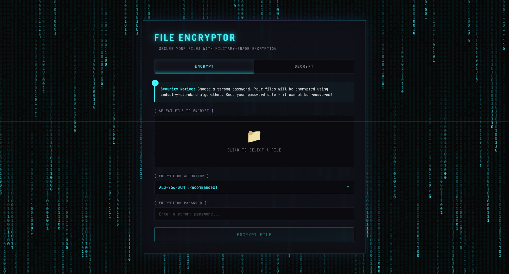

# Husher - Secure File Encryption Application

<div align="center">
  
  
  **A cyber-themed secure file encryption tool built with Tauri**
</div>

---

## 🚀 Features

### Core Encryption
- **AES-256-GCM** - Military-grade encryption (Recommended)
- **ChaCha20-Poly1305** - Modern stream cipher for high performance
- **Argon2** - Secure key derivation from passwords
- **Random salt & nonce** - Each encryption uses unique cryptographic parameters

### Security Features
- Password-based encryption with strong key derivation
- Authentication tags for tamper detection
- Secure file metadata preservation
- No password storage - only you know your password

### Cyber-Themed UI
- Dark matrix rain background
- Neon glow effects and animations
- Glass-morphism design
- Responsive and modern interface
- Real-time scan line animation

---

## 📦 Installation

### Prerequisites
- [Rust](https://rustup.rs/) (latest stable)
- [Node.js](https://nodejs.org/) (v18+)
- [Tauri CLI](https://tauri.app/) (optional, for development)

### Build from Source

```bash
# Clone the repository
git clone https://github.com/yourusername/husher.git
cd husher

# Install dependencies
npm install

# Build the frontend
npm run build

# Build the Tauri application
cd src-tauri
cargo build --release
```

### Run in Development Mode

```bash
cd husher
npm run dev
```

---

## 🎮 Usage

### Encrypting a File

1. Click "Select File to Encrypt" and choose your file
2. Select encryption algorithm (AES-256-GCM recommended)
3. Enter a strong password
4. Click "Encrypt File"
5. Save the encrypted file

### Decrypting a File

1. Click "Select Encrypted File" and choose your `.encrypted` file
2. Enter the password used during encryption
3. Click "Decrypt File"
4. Save the decrypted file

---

## 🔒 Security Details

### Encryption Process

```
File + Password → Argon2 Key Derivation → AES-256-GCM/ChaCha20-Poly1305 → Encrypted File
```

### Key Derivation
- **Algorithm**: Argon2id (memory-hard function)
- **Memory**: 64MB
- **Iterations**: 3
- **Salt**: 16 bytes (random per encryption)

### File Format
```
[4 bytes: metadata length][JSON metadata][Encrypted data]
```

**Metadata includes**:
- Algorithm used
- Salt (base64)
- Nonce (base64)
- Original filename

---

## 🛠️ Technology Stack

### Frontend
- **HTML5** - Semantic markup
- **CSS3** - Custom cyber-themed styling
- **JavaScript** - Vanilla JS for Tauri IPC
- **Vite** - Fast build tool

### Backend
- **Rust** - Systems programming
- **Tauri 2.0** - Desktop framework
- **AES-GCM** - Authenticated encryption
- **ChaCha20-Poly1305** - Stream cipher
- **Argon2** - Password hashing

---

## 📁 Project Structure

```
husher/
├── src-tauri/
│   ├── Cargo.toml          # Rust dependencies
│   ├── tauri.conf.json     # Tauri configuration
│   └── src/
│       └── lib.rs          # Rust encryption backend
├── dist/                   # Built frontend
├── index.html             # Main HTML
├── main.js                # Frontend logic
├── package.json           # Node dependencies
├── vite.config.js         # Vite configuration
└── README.md              # This file
```

---

## 🔧 Development

### Adding New Encryption Algorithms

Edit `src-tauri/src/lib.rs` and add to the `Algorithm` enum:

```rust
#[derive(Debug, Serialize, Deserialize, Clone)]
enum Algorithm {
    AES256GCM,
    ChaCha20Poly1305,
    YourNewAlgorithm,  // Add here
}
```

Then implement the encryption logic in `encrypt_file` function.

### Modifying the UI

Edit `index.html` for structure and `main.js` for functionality.

---

## 🤝 Contributing

1. Fork the repository
2. Create your feature branch (`git checkout -b feature/AmazingFeature`)
3. Commit your changes (`git commit -m 'Add some AmazingFeature'`)
4. Push to the branch (`git push origin feature/AmazingFeature`)
5. Open a Pull Request

---

## 📝 License

This project is licensed under the MIT License - see the [LICENSE](LICENSE) file for details.

---

## 🙏 Acknowledgments

- [Tauri](https://tauri.app/) - Build smaller, faster, and more secure desktop applications
- [RustCrypto](https://github.com/RustCrypto) - High-quality Rust cryptographic libraries
- [Argon2](https://www.cryptolux.org/Argon2) - Password hashing winner of PHC

---

## 📧 Contact

- **Author**: [Biruk Yonas - Buka](https://github.com/buka-pitch)
- **Email**: birukyonas331@gmail.com
- **Project Link**: [https://github.com/yourusername/encrypter](https://github.com/yourusername/encrypter)

---
